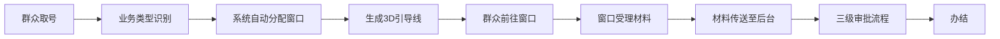
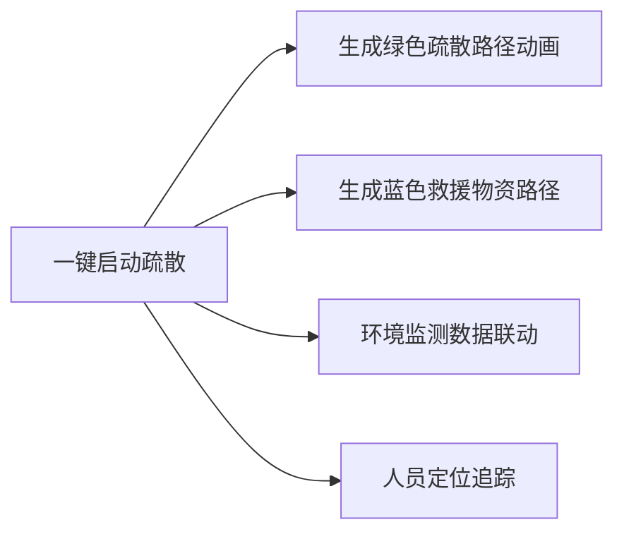

## 1. 产品概述

3D智慧政务服务中心综合调度与便民服务可视化平台，通过三维建模与实时数据联动，实现政务大厅全场景数字化孪生管理。平台整合窗口调度、材料流转、人员定位、环境监测、应急疏散五大核心功能，为政务服务中心提供智能化、可视化的运营管理解决方案。

- 核心价值：提升政务服务效率，优化群众办事体验，实现大厅运营全流程可监控、可调度、可追溯
- 目标用户：窗口办事人员、审批科长、中心领导三级管理人员

## 2. 核心功能

### 2.1 用户角色
| 角色 | 登录方式 | 核心权限 |
|------|----------|----------|
| 窗口人员 | 人脸识别登录 | 查看 assigned 窗口状态、叫号操作、材料受理登记 |
| 审批科长 | 人脸识别登录 | 查看审批进度、科室审核操作、查看科室办件统计 |
| 中心领导 | 人脸识别登录 | 全局调度、应急疏散启动、查看所有运营数据、导出日报 |

### 2.2 功能模块
1. **3D政务大厅场景**：导办台、综合窗口区、后台审批区、休息区、监控室的三维建模与交互
2. **窗口智能调度**：业务类型显示、叫号系统、人员信息展示、自动分配窗口、3D引导线动画
3. **材料流转系统**：三级审批流程（窗口受理-科室审核-领导签批）、传送带3D动画、进度可视化
4. **人员定位管理**：工作人员姓名岗位显示、限制区域报警、人员轨迹追踪
5. **环境监测系统**：温湿度/CO₂实时监测、阈值告警、新风系统3D气流动画
6. **应急疏散系统**：一键启动疏散、绿色疏散路径、蓝色救援物资路径
7. **权限管理系统**：三级权限控制、人脸识别登录、操作日志记录
8. **运营日报系统**：Excel导出、各窗口办件量统计、平均办理时长、群众满意度

### 2.3 页面详情
| 页面名称 | 模块名称 | 功能描述 |
|----------|----------|----------|
| 登录页 | 人脸识别登录 | 摄像头采集人脸、角色识别、登录日志记录 |
| 3D调度大屏 | 主场景渲染 | 政务大厅3D模型渲染、各功能区域可视化 |
| 3D调度大屏 | 窗口信息面板 | 业务类型/叫号/人员信息悬浮显示、点击查看排队详情 |
| 3D调度大屏 | 调度控制区 | 自动分配窗口、启动引导线、应急疏散控制 |
| 3D调度大屏 | 审批进度面板 | 三级审批流程状态显示、材料流转动画 |
| 3D调度大屏 | 环境监测面板 | 温湿度/CO₂实时数据、新风系统控制 |
| 3D调度大屏 | 人员状态面板 | 在岗人员列表、位置显示、报警状态 |
| 数据统计页 | 运营日报 | 按日期查询、办件量统计图表、Excel导出 |

## 3. 核心流程

### 3.1 群众办事流程
群众进入大厅 → 导办台取号 → 系统根据业务类型自动分配窗口 → 生成3D引导线动画指引到窗口 → 窗口受理材料 → 材料通过传送带流转至后台 → 窗口受理→科室审核→领导签批三级审批 → 办结通知

### 3.2 Mermaid流程图

### 3.3 应急疏散流程

## 4. 用户界面设计

### 4.1 设计风格
- **主色调**：政务蓝 (#1E40AF) 作为主色，科技青 (#06B6D4) 为辅助色，警示红 (#DC2626)、成功绿 (#10B981) 为状态色
- **整体风格**：科技感、政务风、简约大气的可视化大屏风格
- **字体**：标题使用思源黑体 Bold，数据展示使用 JetBrains Mono，正文使用思源黑体 Regular
- **视觉元素**：数据面板采用半透明玻璃拟态风格，边框使用发光效果，图表使用渐变填充

### 4.2 3D场景设计
- **环境与氛围**：使用HDR环境贴图模拟政务大厅明亮的室内光照，整体色调偏冷，凸显科技感
- **光照设置**：主光源模拟大厅顶灯，使用DirectionalLight配合AmbientLight，窗口区域添加点光源突出重点
- **相机设置**：初始视角为大厅俯视45度角，支持鼠标拖拽旋转、滚轮缩放、点击聚焦
- **材质与模型**：使用PBR材质，地面为大理石纹理，墙面为浅色哑光，窗口柜台为深色实木纹理
- **后期处理**：添加Bloom泛光效果，使发光面板和数据显示更具科技感
- **性能优化**：使用实例化渲染(InstancedMesh)处理重复元素，LOD控制模型细节

### 4.3 页面设计概览
| 页面名称 | 模块名称 | UI 元素 |
|----------|----------|---------|
| 登录页 | 人脸识别 | 摄像头取景框、人脸检测动画、角色选择、登录按钮 |
| 3D调度大屏 | 主场景 | 3D渲染区域占70%屏幕，右侧20%为数据面板，底部10%为控制栏 |
| 3D调度大屏 | 窗口信息卡 | 悬浮在窗口上方，显示业务类型图标、叫号数字、工作人员姓名 |
| 3D调度大屏 | 审批进度条 | 垂直时间轴样式，显示三级审批节点状态和时间 |
| 3D调度大屏 | 环境仪表盘 | 圆形仪表盘样式，实时数值显示，超阈值时红色闪烁 |
| 数据统计页 | 日报表格 | 可筛选日期，数据表格支持排序，图表区域展示趋势 |

### 4.4 动效设计
- **引导线动画**：使用TubeGeometry创建曲线路径，通过材质偏移实现流动效果
- **材料流转动画**：文件模型沿贝塞尔曲线运动，传送带动画使用纹理偏移
- **气流动画**：使用粒子系统，半透明球体沿管道路径运动模拟新风
- **报警闪烁**：使用TWEEN.js实现材质颜色在正常色和红色间插值
- **疏散路径动画**：箭头模型沿路径逐步显示，使用渐变透明度效果

### 4.5 响应式
- 桌面端为主要使用场景，采用固定布局
- 支持1920x1080及以上分辨率，设计稿以2560x1440为基准
- 控制栏和面板支持最小化，最大化3D显示区域

## 5. 数据展示规范
- 办件量：数字千分位显示，环比变化用红绿箭头标注
- 办理时长：格式为"分:秒"，超阈值标红
- 满意度：星级显示 + 百分比，最低项高亮
- 实时数据：每5秒刷新一次，刷新时有数字滚动动画
