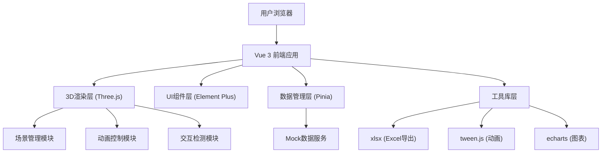

## 1. 架构设计



## 2. 技术描述

- **前端框架**：Vue 3.4 + TypeScript + Vite 5
- **3D渲染**：Three.js 0.160 + @tweenjs/tween.js 20
- **UI组件**：Element Plus 2.4
- **状态管理**：Pinia 2.1
- **路由管理**：Vue Router 4
- **图表库**：ECharts 5.4
- **Excel导出**：xlsx 0.18
- **样式方案**：TailwindCSS 3.4
- **数据方案**：前端Mock数据，模拟实时数据更新

## 3. 目录结构

```
src/
├── assets/              # 静态资源
├── components/          # 通用组件
│   ├── ui/             # UI组件
│   └── three/          # 3D相关组件
├── composables/        # 组合式函数
│   ├── useAuth.ts      # 权限管理
│   ├── useWindow.ts    # 窗口管理
│   ├── useMaterial.ts  # 材料流转
│   ├── usePersonnel.ts # 人员定位
│   ├── useEnvironment.ts # 环境监测
│   └── useEmergency.ts  # 应急疏散
├── store/              # Pinia状态管理
│   ├── auth.ts
│   ├── hall.ts
│   ├── window.ts
│   └── statistics.ts
├── views/              # 页面组件
│   ├── Login.vue
│   ├── Dashboard.vue
│   └── Statistics.vue
├── three/              # Three.js核心逻辑
│   ├── core/           # 场景、相机、渲染器
│   ├── models/         # 3D模型构建
│   ├── animations/     # 动画系统
│   └── controls/       # 交互控制
├── mock/               # Mock数据
│   ├── data.ts
│   └── index.ts
├── types/              # TypeScript类型定义
└── utils/              # 工具函数
    ├── excel.ts
    └── helpers.ts
```

## 4. 路由定义

| 路由 | 页面 | 权限要求 |
|------|------|----------|
| /login | 登录页 | 公开 |
| /dashboard | 3D调度大屏 | 登录用户 |
| /statistics | 数据统计与日报导出 | 审批科长及以上 |

## 5. 核心数据模型

### 5.1 类型定义

```typescript
// 窗口信息
interface WindowInfo {
  id: string
  number: number
  businessType: 'tax' | 'social' | 'industry'
  businessName: string
  currentNumber: string
  staffName: string
  processDuration: number
  queueCount: number
  avgWaitTime: number
  status: 'idle' | 'busy' | 'offline'
  position: { x: number; y: number; z: number }
}

// 审批流程
interface ApprovalProcess {
  id: string
  materialId: string
  materialName: string
  submitter: string
  windowId: string
  steps: ApprovalStep[]
  currentStep: number
  startTime: Date
}

interface ApprovalStep {
  name: '窗口受理' | '科室审核' | '领导签批'
  status: 'pending' | 'processing' | 'completed'
  operator: string
  time: Date
}

// 人员信息
interface Personnel {
  id: string
  name: string
  position: string
  role: 'window' | 'chief' | 'leader'
  location: { x: number; y: number; z: number }
  isRestricted: boolean
  alertActive: boolean
}

// 环境数据
interface EnvironmentData {
  temperature: number
  humidity: number
  co2: number
  fanStatus: 'on' | 'off'
  thresholds: {
    temperature: number
    humidity: number
    co2: number
  }
}

// 日报数据
interface DailyReport {
  date: string
  windows: WindowDaily[]
  totalCount: number
  avgDuration: number
  satisfaction: number
}

interface WindowDaily {
  windowId: string
  windowNumber: number
  businessType: string
  count: number
  avgDuration: number
  satisfaction: number
}
```

### 5.2 数据状态管理

使用Pinia管理以下核心状态：
- `authStore`：用户登录状态、权限、操作日志
- `hallStore`：3D场景状态、环境数据、应急状态
- `windowStore`：窗口列表、叫号状态、分配逻辑
- `statisticsStore`：日报数据、统计图表数据

## 6. 关键技术实现

### 6.1 3D场景实现
- **场景构建**：使用Three.js原生API构建大厅模型，包括墙体、地板、天花板
- **窗口建模**：使用Group组合多个Mesh构建窗口柜台、显示屏、座椅
- **材质系统**：使用MeshStandardMaterial实现PBR材质，配合纹理贴图
- **标注系统**：使用CSS2DRenderer实现DOM元素悬浮在3D物体上方
- **交互检测**：使用Raycaster实现点击、悬停检测

### 6.2 动画系统
- **引导线动画**：使用CatmullRomCurve3创建曲线路径，TubeGeometry生成管道，通过修改material.map.offset实现流动效果
- **材料流转**：使用贝塞尔曲线作为路径，TWEEN.js控制物体沿曲线运动
- **气流动画**：使用Points创建粒子系统，每个粒子独立更新位置模拟气流
- **报警闪烁**：使用TWEEN.js的Color插值实现颜色渐变动画

### 6.3 权限控制
- 路由守卫：根据用户角色拦截路由访问
- 组件级权限：自定义v-permission指令控制按钮显示
- 操作日志：所有关键操作记录到localStorage

### 6.4 Excel导出
- 使用xlsx库构建工作簿
- 支持按日期范围筛选数据
- 自动生成统计公式
- 包含窗口明细和汇总sheet

## 7. 性能优化策略

1. **3D渲染优化**
   - 使用InstancedMesh渲染重复的座椅、灯具等物体
   - 合理设置像素比(Math.min(window.devicePixelRatio, 2))
   - 使用Frustum Culling剔除不可见物体
   - 阴影贴图使用合适的分辨率

2. **数据更新优化**
   - 使用requestAnimationFrame统一动画更新
   - 数据更新采用节流，避免频繁重渲染
   - 使用Vue的computed和watch进行细粒度更新

3. **内存管理**
   - 组件卸载时清理Three.js资源(geometry, material, texture)
   - 及时移除事件监听器
   - 粒子系统对象池复用

## 8. 开发与构建

- 开发环境：npm run dev
- 生产构建：npm run build
- 代码检查：eslint + prettier
- 类型检查：vue-tsc --noEmit
